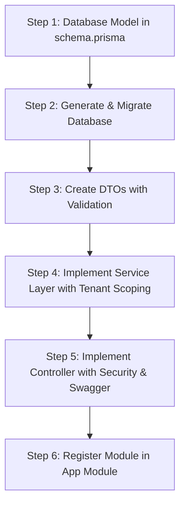

# API Creation and Structure Guide

This guide details the step-by-step process, architecture, and code conventions required to create a new, production-ready REST API in the **Hisab247** NestJS backend. 

To illustrate these principles clearly, we will walk through the creation of a **Suppliers API**—a vital feature for a SaaS POS that is currently missing from the codebase.

---

## 1. Directory Structure

Each feature in the backend resides in its own isolated module under `src/modules/`. A standard module should have the following folder structure:

```
src/modules/suppliers/
├── dto/
│   ├── create-supplier.dto.ts   # Body validation for POST/PUT requests
│   └── list-suppliers.dto.ts     # Query validation and filters for lists
├── suppliers.controller.ts      # HTTP route handlers, guards, and Swagger metadata
├── suppliers.module.ts          # NestJS module definition wiring up providers
└── suppliers.service.ts         # Business logic, Prisma queries, and cache controls
```

---

## 2. Step-by-Step API Development Flow

Follow these 6 steps to implement any new API in the codebase:



### Step 1: Database Modeling with Prisma

All business tables in Hisab247 must support **multi-tenancy** and **soft deletes**. 

Open `prisma/schema.prisma` and add your model. Ensure it includes:
1. `id` as a primary key using `cuid()`.
2. `publicId` (a 6-digit public identifier for user-facing lookups).
3. `storeId` linked to the `Store` model (the tenancy partition key).
4. `deletedAt` for soft deletes.
5. Indexes on `storeId` and `deletedAt` to keep queries fast.

```prisma
// prisma/schema.prisma

model Supplier {
  id        String    @id @default(cuid())
  publicId  String    // 6-digit public identifier, unique within a store
  storeId   String
  name      String
  email     String?
  phone     String?
  address   String?
  notes     String?
  createdAt DateTime  @default(now())
  updatedAt DateTime  @updatedAt
  deletedAt DateTime?

  store     Store     @relation(fields: [storeId], references: [id], onDelete: Cascade)

  @@unique([storeId, publicId])
  @@unique([storeId, phone]) // Prevent duplicate suppliers by phone per store
  @@index([storeId, createdAt(sort: Desc)])
  @@index([deletedAt])
  @@map("suppliers")
}
```

> [!NOTE]
> Don't forget to update the `Store` model in `prisma/schema.prisma` to include the opposite relation:
> `suppliers Supplier[]`

---

### Step 2: Database Migration & Client Generation

Generate a new migration and update the Prisma Client by running the following commands in your shell:

```powershell
# Create and apply the SQL migration
npx prisma migrate dev --name add_suppliers_table

# Force regenerate the Prisma client types
npx prisma generate
```

---

### Step 3: Define Data Transfer Objects (DTOs)

DTOs strictly validate incoming requests at runtime using `class-validator` and `class-transformer`.

#### A. Create Supplier DTO
This validates payload schemas for creating and updating resources:

```typescript
// src/modules/suppliers/dto/create-supplier.dto.ts
import { IsEmail, IsOptional, IsString, Length } from 'class-validator';

export class CreateSupplierDto {
  @IsString()
  @Length(1, 120)
  name!: string;

  @IsOptional()
  @IsEmail()
  email?: string;

  @IsOptional()
  @IsString()
  @Length(3, 30)
  phone?: string;

  @IsOptional()
  @IsString()
  @Length(0, 400)
  address?: string;

  @IsOptional()
  @IsString()
  @Length(0, 1000)
  notes?: string;
}
```

#### B. List Suppliers DTO
This handles paginated queries and search filters:

```typescript
// src/modules/suppliers/dto/list-suppliers.dto.ts
import { IsOptional, IsString, Length } from 'class-validator';
import { PaginationDto } from '../../../common/utils/pagination';

export class ListSuppliersDto extends PaginationDto {
  @IsOptional()
  @IsString()
  @Length(1, 80)
  search?: string;
}
```

---

### Step 4: Implement the Service Layer

The service class encapsulates all database operations. **Crucially, all operations must be restricted to the active tenant's `storeId` and exclude soft-deleted rows (`deletedAt: null`).**

```typescript
// src/modules/suppliers/suppliers.service.ts
import { Injectable, NotFoundException, ConflictException } from '@nestjs/common';
import { Prisma } from '@prisma/client';
import { PrismaService } from '../../prisma/prisma.service';
import { buildPage } from '../../common/utils/pagination';
import { generatePublicId } from '../../common/utils/public-id';
import { CreateSupplierDto } from './dto/create-supplier.dto';
import { ListSuppliersDto } from './dto/list-suppliers.dto';

@Injectable()
export class SuppliersService {
  constructor(private readonly prisma: PrismaService) {}

  /**
   * Find suppliers in the store with pagination and fuzzy search
   */
  async list(storeId: string, q: ListSuppliersDto) {
    const mode = Prisma.QueryMode.insensitive;
    const where: Prisma.SupplierWhereInput = {
      storeId,
      deletedAt: null,
      ...(q.search && {
        OR: [
          { name: { contains: q.search, mode } },
          { email: { contains: q.search, mode } },
          { phone: { contains: q.search, mode } },
          { publicId: { contains: q.search, mode } },
        ],
      }),
    };

    const [rows, total] = await this.prisma.$transaction([
      this.prisma.supplier.findMany({
        where,
        orderBy: { createdAt: 'desc' },
        skip: q.skip,
        take: q.take,
      }),
      this.prisma.supplier.count({ where }),
    ]);

    return buildPage(rows, total, q);
  }

  /**
   * Fetch a single supplier by CUID or publicId
   */
  async getById(storeId: string, id: string) {
    const row = await this.prisma.supplier.findFirst({
      where: {
        storeId,
        deletedAt: null,
        OR: [{ id }, { publicId: id }],
      },
    });
    if (!row) throw new NotFoundException('Supplier not found');
    return row;
  }

  /**
   * Create a new supplier (handles retries on 6-digit publicId collision)
   */
  async create(storeId: string, dto: CreateSupplierDto) {
    if (dto.phone) {
      const existing = await this.prisma.supplier.findFirst({
        where: { storeId, phone: dto.phone, deletedAt: null },
        select: { id: true },
      });
      if (existing) {
        throw new ConflictException('A supplier with this phone number already exists');
      }
    }

    const supplier = await this.createWithRetry(storeId, dto);
    return {
      message: 'Supplier created successfully',
      data: supplier,
    };
  }

  /**
   * Update supplier details
   */
  async update(storeId: string, id: string, dto: Partial<CreateSupplierDto>) {
    const existing = await this.getById(storeId, id);
    const updated = await this.prisma.supplier.update({
      where: { id: existing.id },
      data: dto,
    });
    return { message: 'Supplier updated successfully', data: updated };
  }

  /**
   * Soft delete a supplier
   */
  async softDelete(storeId: string, id: string) {
    const existing = await this.getById(storeId, id);
    await this.prisma.supplier.update({
      where: { id: existing.id },
      data: { deletedAt: new Date() },
    });
    return { message: 'Supplier deleted successfully', data: { id: existing.id } };
  }

  /**
   * Generates a 6-digit public identifier and retries on collision
   */
  private async createWithRetry(storeId: string, dto: CreateSupplierDto, attempt = 0): Promise<any> {
    try {
      return await this.prisma.supplier.create({
        data: {
          publicId: generatePublicId(),
          storeId,
          name: dto.name,
          email: dto.email,
          phone: dto.phone,
          address: dto.address,
          notes: dto.notes,
        },
      });
    } catch (err) {
      // P2002 represents Unique Constraint Violation
      if (
        err instanceof Prisma.PrismaClientKnownRequestError &&
        err.code === 'P2002' &&
        attempt < 3
      ) {
        return this.createWithRetry(storeId, dto, attempt + 1);
      }
      throw err;
    }
  }
}
```

---

### Step 5: Implement the Controller Layer

Controllers map HTTP routes to your services. They enforce authorization using `@Roles(...)` metadata and extract multi-tenant values via custom decorators.

> [!IMPORTANT]
> - By default, **all routes require JWT authentication** since `JwtAuthGuard` is registered globally.
> - `@Roles(...)` enforces Role-Based Access Control (RBAC) via the global `RolesGuard`.
> - `@StoreId()` safely extracts the verified tenant ID.
> - `@CurrentUser()` retrieves the complete payload of the authenticated user.

```typescript
// src/modules/suppliers/suppliers.controller.ts
import {
  Body,
  Controller,
  Delete,
  Get,
  Param,
  Post,
  Put,
  Query,
} from '@nestjs/common';
import { ApiBearerAuth, ApiOperation, ApiTags } from '@nestjs/swagger';
import { UserRole } from '@prisma/client';

import { SuppliersService } from './suppliers.service';
import { CreateSupplierDto } from './dto/create-supplier.dto';
import { ListSuppliersDto } from './dto/list-suppliers.dto';
import { StoreId } from '../../common/decorators/store-id.decorator';
import { Roles } from '../../common/decorators/roles.decorator';

@ApiTags('suppliers')
@ApiBearerAuth()
@Controller('suppliers/management')
export class SuppliersController {
  constructor(private readonly suppliers: SuppliersService) {}

  @Get()
  @ApiOperation({ summary: 'List suppliers (paginated, searchable)' })
  list(@StoreId() storeId: string, @Query() q: ListSuppliersDto) {
    return this.suppliers.list(storeId, q);
  }

  @Post()
  @Roles(UserRole.ADMIN, UserRole.MANAGER)
  @ApiOperation({ summary: 'Create a supplier' })
  create(@StoreId() storeId: string, @Body() dto: CreateSupplierDto) {
    return this.suppliers.create(storeId, dto);
  }

  @Get(':id')
  @ApiOperation({ summary: 'Get a supplier by CUID or publicId' })
  getOne(@StoreId() storeId: string, @Param('id') id: string) {
    return this.suppliers.getById(storeId, id);
  }

  @Put(':id')
  @Roles(UserRole.ADMIN, UserRole.MANAGER)
  @ApiOperation({ summary: 'Update a supplier' })
  update(
    @StoreId() storeId: string,
    @Param('id') id: string,
    @Body() dto: Partial<CreateSupplierDto>,
  ) {
    return this.suppliers.update(storeId, id, dto);
  }

  @Delete(':id')
  @Roles(UserRole.ADMIN)
  @ApiOperation({ summary: 'Soft-delete a supplier' })
  remove(@StoreId() storeId: string, @Param('id') id: string) {
    return this.suppliers.softDelete(storeId, id);
  }
}
```

---

### Step 6: Wiring Modules Together

Create the module definition in your feature folder to declare controllers, providers, and exports:

```typescript
// src/modules/suppliers/suppliers.module.ts
import { Module } from '@nestjs/common';
import { SuppliersController } from './suppliers.controller';
import { SuppliersService } from './suppliers.service';

@Module({
  controllers: [SuppliersController],
  providers: [SuppliersService],
  exports: [SuppliersService],
})
export class SuppliersModule {}
```

Finally, register your module in `src/app.module.ts` to include it in the NestJS dependency graph:

```typescript
// src/app.module.ts (excerpts)
import { SuppliersModule } from './modules/suppliers/suppliers.module';

@Module({
  imports: [
    // ... other imports
    SuppliersModule,
  ],
  // ...
})
export class AppModule {}
```

---

## 3. How to Test Your New API

Since the backend operates under **verification-only JWT authentication**, you must provide a valid authorization header for every local request.

### A. Issue a Test Token
The repository includes a script to issue valid test tokens for different personas. Open your terminal and run:

```powershell
npm run token admin      # Issues a token for UserRole.ADMIN
npm run token manager    # Issues a token for UserRole.MANAGER
npm run token cashier    # Issues a token for UserRole.CASHIER
```

This prints a long JWT. Copy the JWT value.

### B. Make Requests
Configure your HTTP client (Postman, Insomnia, or cURL) as follows:

- **Headers**:
  - `Authorization`: `Bearer <PASTE_JWT_HERE>`
  - `Content-Type`: `application/json`

- **Endpoint Examples**:
  - **Create Supplier** (`POST /api/v1/suppliers/management`):
    ```json
    {
      "name": "Global POS Distributors Ltd.",
      "email": "sales@globalpos.com",
      "phone": "+8801700000123",
      "address": "Banani Road 11, Dhaka, Bangladesh",
      "notes": "Premium vendor for barcode scanners"
    }
    ```
  - **Get Paginated List** (`GET /api/v1/suppliers/management?page=1&limit=10&search=Global`):
    Retrieves filtered results scoped exclusively to the active tenant.

---

## 4. Key Tenancy Security Reminders

To preserve data integrity and system security, adhere to these strict rules during API development:

> [!CAUTION]
> **1. Guard against SQL injection & leakage**
> Never construct raw Prisma queries without passing the tenant scoping parameter: `where: { storeId: user.storeId }`. Unscoped reads constitute a critical data leakage vulnerability.
>
> **2. Trust `req.user` implicitly**
> Always extract the current store and operator identities from the cryptographically verified JWT context using the `@StoreId()` and `@CurrentUser()` decorators. Never trust a client-supplied identifier in the URL path or body unless verified.
>
> **3. Enforce Soft-deletes**
> Always verify that queries contain `deletedAt: null` to avoid retrieving archived database records.
